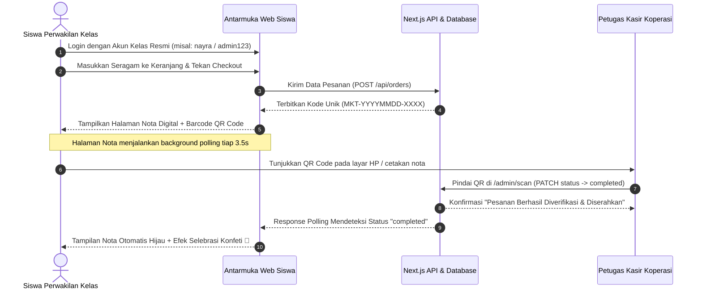

# SYSTEM DESIGN DOCUMENT & STORYBOARD
# MARKET BIRU — KOPERASI SISWA SMKN 11 BANDUNG

**Dokumentasi Perancangan Aplikasi E-Commerce & Kasir Digital**  
**Platform:** Web App (Responsive Desktop & Mobile) — Next.js 14 App Router  
**Versi:** 1.0 | September 2026  
**Penyusun:** Tim Pengembang Market Biru SMKN 11 Bandung  

---

## Daftar Isi

1. **Konsep Dasar** ......................................................................................................... 3
   - 1.1 Identitas Aplikasi .............................................................................................. 3
   - 1.2 Premis & Latar Belakang Masalah ..................................................................... 3
   - 1.3 Tiga Pilar Pengalaman Pengguna ...................................................................... 3
2. **Kontrol & Antarmuka Interaksi (Input & User Interface)** ............................................ 4
   - 2.1 Matriks Kontrol Platform (Desktop & Mobile) ..................................................... 4
   - 2.2 Catatan Desain Antarmuka Siswa & Kasir ........................................................... 4
3. **Alur Sistem & Pengalaman Pengguna (System Flow)** .................................................. 5
   - 3.1 Halaman Beranda (Landing Page) ....................................................................... 5
   - 3.2 Katalog 7 Produk Resmi SMKN 11 ...................................................................... 5
   - 3.3 Autentikasi Siswa Perwakilan Kelas ................................................................... 5
   - 3.4 Keranjang Belanja & Form Checkout .................................................................. 6
   - 3.5 Nota Digital, Barcode QR Code, & Live Polling ................................................... 6
   - 3.6 Pemindaian QR Kasir & Real-Time Sync ............................................................. 7
   - 3.7 Laporan Keuangan & Ekspor Omset ................................................................... 7
4. **Elemen Visual & Identitas Desain** ............................................................................ 8
   - 4.1 Gaya Visual & UI/UX Design System .................................................................. 8
   - 4.2 Skema Warna Utama (Brand Palette) ................................................................ 8
   - 4.3 Tipografi & Komponen Interaktif ........................................................................ 8
5. **Spesifikasi Katalog 7 Produk Resmi SMKN 11 Bandung** ........................................... 9
   - 5.1 Daftar Produk, SKU, Harga, & Stok Awal ............................................................ 9
6. **Sistem Finansial & Logika Transaksi** ....................................................................... 10
   - 6.1 Sistem Kode Transaksi Unik ............................................................................. 10
   - 6.2 Perhitungan Omset Penjualan & Biaya Kirim ..................................................... 10
   - 6.3 Rekapitulasi Kanal Pembayaran & Pengantaran ................................................ 10
   - 6.4 Format Ekspor Spreadsheet (Excel / CSV) ........................................................ 11
   - 6.5 Format Cetak Lembar Pengesahan Laporan PDF ............................................... 11
7. **Rekomendasi Pengembangan (Roadmap Ide)** ........................................................... 12
   - A. Notifikasi Otomatis WhatsApp Gateway ........................................................... 12
   - B. Pembayaran Digital QRIS Otomatis (Payment Gateway) ...................................... 12
   - C. Kartu Digital Siswa & Barcode Fisik NISN .......................................................... 12
   - D. Rekomendasi Teknis & Arsitektur Database ........................................................ 12
8. **Status Implementasi & Rencana Lanjutan** ............................................................... 13
   - 8.1 Status Implementasi Saat Ini (Next.js 14 + MySQL) ............................................ 13
   - 8.2 Rencana Lanjutan ............................................................................................. 13

---

## 1. Konsep Dasar

### 1.1 Identitas Aplikasi
- **Judul Sistem:** Market Biru
- **Kategori / Genre:** Web E-Commerce Koperasi Sekolah & Point of Sale (POS) Kasir Terintegrasi
- **Platform:** Web Responsive (Desktop, Tablet, & Mobile Browser) — Next.js 14 App Router, TypeScript, TailwindCSS, MySQL 8
- **Target Pengguna:** Siswa/Siswi perwakilan kelas SMKN 11 Bandung, Petugas Kasir Koperasi, Pengurus Koperasi Sekolah

### 1.2 Premis & Latar Belakang Masalah
Koperasi Siswa SMK Negeri 11 Bandung melayani kebutuhan ratusan siswa setiap harinya, terutama seragam resmi, atribut bordir, pakaian olahraga, hingga kelengkapan praktik kerja lapangan. Pada jam istirahat sekolah yang singkat, antrean fisik di koperasi seringkali sangat padat, memicu ketidaknyamanan, rawan kesalahan pencatatan transaksi manual, serta menghambat rekapitulasi omset harian.

**Market Biru** dirancang sebagai ekosistem digital terpadu yang memfasilitasi pre-order seragam resmi secara online per kelas, menerbitkan nota digital ber-QR Code, mempercepat verifikasi barang di kasir melalui pemindaian kamera, serta menyajikan pembukuan omset otomatis yang dapat langsung diekspor ke Microsoft Excel atau dicetak ke lembar PDF resmi.

### 1.3 Tiga Pilar Pengalaman Pengguna
1. **Efisiensi & Bebas Antre (Seamless Pre-Order):** Siswa perwakilan kelas dapat memesan seragam dari ruang kelas sebelum jam istirahat; pesanan sudah siap ambil di kasir atau diantar langsung.
2. **Sinkronisasi Real-Time Siswa-Kasir (Live QR Sync):** Kasir memindai QR Code nota siswa di panel kasir, dan dalam hitungan detik nota di layar HP siswa otomatis berganti status menjadi "Selesai" disertai selebrasi konfeti tanpa perlu memuat ulang peramban.
3. **Akuntabilitas Finansial & Ekspor 1-Klik (Financial Accountability):** Penghitungan omset penjualan kotor, pendapatan biaya antar, dan pemisahan kas tunai/transfer tercatat otomatis dan siap diekspor ke spreadsheet untuk laporan pertanggungjawaban.

---

## 2. Kontrol & Antarmuka Interaksi (Input & User Interface)

### 2.1 Matriks Kontrol Platform
| Platform | Aksi Navigasi & Belanja | Aksi Kasir & Verifikasi |
|---|---|---|
| **Desktop / Laptop** | Klik mouse, filter kategori tab, form checkout dengan keyboard autocomplete | Input kode nota via keyboard / scanner barcode USB, klik tombol verifikasi 1-klik |
| **Mobile / Tablet** | Touch tap responsive, touch drawer keranjang belanja, floating action cart | Pemindaian kamera langsung via WebCam HTML5, tombol konfirmasi status sentuh |

### 2.2 Catatan Desain Antarmuka Siswa & Kasir
- **Sederhana & Bebas Tumpukan Teks:** Antarmuka disederhanakan dengan kartu visual yang bersih, teks informatif to-the-point, dan kontras warna yang nyaman di mata.
- **Wajib Login Siswa:** Mencegah pesanan palsu (spam order) dengan mewajibkan autentikasi akun resmi perwakilan kelas sebelum siswa dapat memasukkan barang ke keranjang atau checkout.
- **Responsif di Semua Ukuran Layar:** Menggunakan Tailwind CSS fluid grid system yang menyesuaikan tata letak saat dibuka di smartphone siswa maupun monitor kasir koperasi.

---

## 3. Alur Sistem & Pengalaman Pengguna (System Flow)

### 3.1 Halaman Beranda (Landing Page)
Menampilkan identitas SMKN 11 Bandung, banner promosi seragam resmi, pintasan lacak pesanan, dan tombol navigasi langsung ke katalog belanja.

### 3.2 Katalog 7 Produk Resmi SMKN 11
Menampilkan 7 produk seragam dan atribut resmi sekolah yang dikelompokkan ke dalam 2 kategori:
1. *Seragam & Atribut Resmi* (Topi, Sabuk, Dasi, Kaos Kaki)
2. *Pakaian & Seragam Sekolah* (Jas Almamater/Almet, Baju Batik Identitas, Seragam Olahraga)

### 3.3 Autentikasi Siswa Perwakilan Kelas
- Sistem login terpusat yang mencocokkan identitas siswa dengan database terdaftar.
- Data siswa (Nama, Kelas, No WhatsApp) otomatis terhubung saat proses transaksi.

### 3.4 Keranjang Belanja & Form Checkout
- Menghitung subtotal belanja secara otomatis dan real-time.
- Opsi Pengantaran:
  - **Ambil di Koperasi** (Gratis / Rp 0).
  - **Diantar ke Ruang Kelas** (Biaya kurir siswa Rp 2.000).
- Opsi Pembayaran:
  - **Bayar Tunai di Kasir**.
  - **Transfer Bank / QRIS**.

### 3.5 Nota Digital, Barcode QR Code, & Live Polling
- Menampilkan rincian transaksi lengkap, instruksi pembayaran, dan QR Code terenkripsi berbasis kode pesanan.
- Dilengkapi **Background Auto-Polling (3.5 detik)** yang memantau status pesanan langsung dari database.

### 3.6 Pemindaian QR Kasir & Real-Time Sync
- Petugas kasir membuka `/admin/scan` dan mengarahkan kamera ke QR Code siswa atau memasukkan kode nota.
- Sekali klik **"Verifikasi & Selesaikan"**, database terupdate dan layar nota siswa seketika meledak dengan efek konfeti selebrasi.

### 3.7 Laporan Keuangan & Ekspor Omset
- Menampilkan grafik omset penjualan kotor, rekap kas tunai vs transfer, dan peringkat produk terlaris.
- Tombol **Ekspor Excel / CSV** mengunduh laporan berformat akuntansi siap pakai.
- Tombol **Cetak PDF** menghasilkan lembar laporan berkop resmi lengkap dengan kolom tanda tangan pengurus.

---

## 4. Elemen Visual & Identitas Desain

### 4.1 Gaya Visual & UI/UX Design System
- **Modern Clean Blue:** Nuansa biru navy profesional melambangkan identitas resmi "Market Biru" SMK Negeri 11 Kota Bandung.
- **Card-Based Hierarchy:** Pengelompokan informasi menggunakan kartu rounded dengan bayangan halus (soft shadow) dan border kontras rendah.

### 4.2 Skema Warna Utama (Brand Palette)
- **Primary Navy:** `#1e3a8a` (Blue 900) & `#1e40af` (Blue 800)
- **Accent Emerald (Success):** `#059669` (Emerald 600) — menandakan pesanan lunas/selesai.
- **Accent Amber (Warning):** `#d97706` (Amber 600) — menandakan pesanan pending/menunggu kasir.
- **Neutral Dark & Light:** `#0f172a` (Slate 900) dan `#f8fafc` (Slate 50).

### 4.3 Tipografi & Komponen Interaktif
- Tipografi berbasis sans-serif modern dengan penekanan ketebalan (font-black & font-bold) pada judul dan angka nominal rupiah.
- Format mata uang terstandarisasi Rupiah Indonesia (`Rp xx.xxx`).

---

## 5. Spesifikasi Katalog 7 Produk Resmi SMKN 11 Bandung

| No | ID Produk | Kategori | Nama Produk Resmi | Harga Satuan | Stok Awal | Satuan |
|---|---|---|---|---|---|---|
| 1 | `prod-1` | `cat-1` (Seragam & Atribut) | Topi Upacara Bordir SMKN 11 Bandung | Rp 18.000 | 95 | pcs |
| 2 | `prod-2` | `cat-1` (Seragam & Atribut) | Sabuk / Ikat Pinggang Gesper Logam SMKN 11 | Rp 20.000 | 85 | pcs |
| 3 | `prod-3` | `cat-1` (Seragam & Atribut) | Dasi Abu-Abu Resmi SMKN 11 (Bordir Logo) | Rp 15.000 | 120 | pcs |
| 4 | `prod-4` | `cat-1` (Seragam & Atribut) | Kaos Kaki Putih Telapak Hitam Bordir SMKN 11 | Rp 15.000 | 100 | pasang |
| 5 | `prod-5` | `cat-2` (Pakaian Sekolah) | Jas Almamater (Almet) Resmi SMKN 11 Bandung | Rp 135.000 | 75 | pcs |
| 6 | `prod-6` | `cat-2` (Pakaian Sekolah) | Baju Batik Khas SMKN 11 Bandung | Rp 85.000 | 80 | pcs |
| 7 | `prod-7` | `cat-2` (Pakaian Sekolah) | Setelan Seragam Olahraga SMKN 11 Bandung | Rp 95.000 | 80 | set |

---

## 6. Sistem Finansial & Logika Transaksi

### 6.1 Sistem Kode Transaksi Unik
Format pembuatan kode nota transaksi:
$$\text{Order Code} = \text{"MKT-"} + \text{YYYYMMDD} + \text{"-"} + \text{4 Digit Random / Urut}$$
*Contoh:* `MKT-20260909-8472`

### 6.2 Perhitungan Omset Penjualan & Biaya Kirim
- **Total Omset Penjualan:**
  $$\text{Total Omset} = \sum_{i=1}^{n} \text{Total Harga Pesanan}_{\text{status = completed}}$$
- **Omset Penjualan Produk Murni:**
  $$\text{Omset Produk} = \text{Total Omset} - \sum \text{Biaya Pengantaran}$$
- **Rata-rata Nilai Transaksi (AOV):**
  $$\text{AOV} = \frac{\text{Total Omset}}{\text{Jumlah Transaksi Selesai}}$$

### 6.3 Rekapitulasi Kanal Pembayaran & Pengantaran
1. **Kanal Bayar Kasir (Tunai):** Menghitung total fisik uang tunai yang wajib ada di laci kasir koperasi saat tutup buku.
2. **Kanal Transfer / QRIS:** Menghitung total mutasi rekening bank / e-wallet koperasi sekolah.
3. **Rekap Pengantaran:** Memisahkan pesanan yang diambil langsung siswa dengan pesanan kurir pengantaran kelas.

### 6.4 Format Ekspor Spreadsheet (Excel / CSV)
Dokumen `.csv` diekspor menggunakan encoding **UTF-8 with BOM** (`\uFEFF`) agar otomatis terformat rapi pada Microsoft Excel tanpa distorsi tanda baca atau huruf.
- **Kolom:** *No, Kode Pesanan, Waktu Transaksi, Nama Siswa, Kelas, No WhatsApp, Metode Ambil, Lokasi Antar, Metode Bayar, Status Bayar, Rincian Barang & Qty, Subtotal Produk, Biaya Antar, Total Biaya, Status Pesanan.*
- **Baris Penutup:** Baris rekapitulasi total omset akuntansi.

### 6.5 Format Cetak Lembar Pengesahan Laporan PDF
Dilengkapi kop surat resmi SMKN 11 Bandung dan **Lembar Tanda Tangan Pengesahan** antara Ketua Pengurus Koperasi dan Petugas Kasir.

---

## 7. Rekomendasi Pengembangan (Roadmap Ide)

### A. Notifikasi Otomatis WhatsApp Gateway
- Pengiriman notifikasi nota dan status pesanan otomatis ke nomor WhatsApp siswa atau wali kelas saat pesanan selesai disiapkan.

### B. Pembayaran Digital QRIS Otomatis (Payment Gateway)
- Integrasi Midtrans / Xendit / QRIS Dinamis Bank Indonesia sehingga pembayaran QRIS siswa langsung terverifikasi secara otomatis oleh sistem perbankan.

### C. Kartu Digital Siswa & Barcode Fisik NISN
- Pembuatan kartu anggota digital di profil siswa yang dapat dipindai langsung di kasir koperasi untuk transaksi kilat tanpa uang tunai (Koperasi Saldo Siswa).

### D. Rekomendasi Teknis & Arsitektur Database
- Peningkatan ke arsitektur WebSocket (Socket.io) untuk event-driven real-time updates jika skala transaksi mencapai ribuan pesanan serentak.

---

## 8. Status Implementasi & Rencana Lanjutan

### 8.1 Status Implementasi Saat Ini (Prototype Next.js 14 + MySQL)
| Fitur / Modul Sistem | Status |
|---|---|
| Autentikasi Pengguna & Role Guard (Admin, Kasir, Siswa) | Selesai |
| Katalog 7 Produk Resmi SMKN 11 Bandung | Selesai |
| Keranjang Belanja & Form Checkout Beridentitas Kelas | Selesai |
| Generator Kode Pesanan Unik `MKT-...` & Nota Digital | Selesai |
| Barcode QR Code Dinamis pada Nota Siswa | Selesai |
| Live Auto-Polling Status Pesanan (3.5 Detik) | Selesai |
| Efek Selebrasi Konfeti saat Pesanan Selesai Diverifikasi | Selesai |
| Scanner QR Kamera & Input Manual Kasir (`/admin/scan`) | Selesai |
| Dashboard Finansial & Peringkat Penjualan Produk | Selesai |
| Sistem Ekspor 1-Klik ke Microsoft Excel / CSV | Selesai |
| Format Cetak Laporan PDF Resmi Berkop & Lembar TTD | Selesai |
| Verifikasi Build Produksi Next.js (`npm run build` 0 Error) | Selesai |
| Integrasi Notifikasi WhatsApp Gateway Otomatis | Belum |
| Integrasi Payment Gateway QRIS Dinamis Bank Indonesia | Belum |
| Kartu Anggota Saldo Digital Siswa | Belum |

### 8.2 Rencana Lanjutan
1. **Playtesting Demo Presentasi:** Menguji alur belanja siswa perwakilan kelas dan scan QR kasir di hadapan penguji/audiens.
2. **Pencatatan Transaksi Nyata:** Menggunakan sistem untuk mendata pre-order seragam resmi tahun ajaran baru di SMKN 11 Bandung.
3. **Penerapan Ekspor Keuangan Mingguan:** Memanfaatkan fitur ekspor CSV dan cetak laporan PDF untuk pembukuan kas rutin koperasi.
4. **Implementasi Fase 2:** Mengembangkan WhatsApp Gateway dan QRIS Dinamis sesuai roadmap pada Bagian 7.
